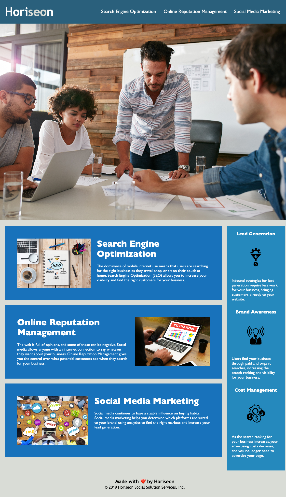

# SEO Challenge 1

## Description

This is the code for the website of the SEO, Online Reputation, and Social Media Marketing company, Horiseon. It has been created by the Bootcamp Curriculum team and refactored by Elias Spector-Zabusky to ensure it follows accessibility standards and to guarantee that the code is clean and ready to be expanded on in the future. This site should serve as a great introduction to the company, what they do, and their benefits and serves as a marketing tool for their services to interested clients.

## Installation

N/A

## Usage

To use this page, <a href="https://coldweatherboyy.github.io/seo-challenge-1/">click here</a> and browse. Utilize navbar links to jump to appropriate sections. Screenshot as can be seen below:

## Credits

This was refactored in [VS Code](https://code.visualstudio.com/).

## License

N/A